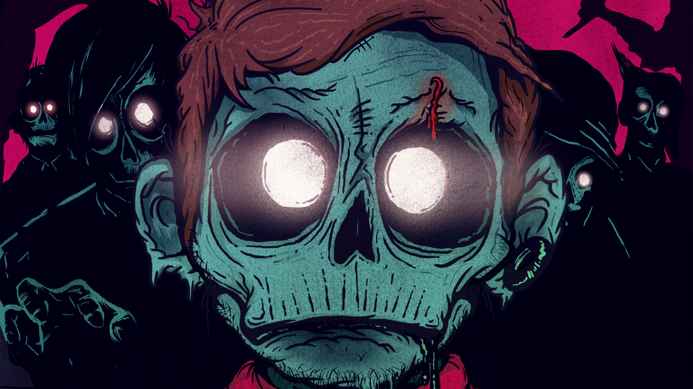
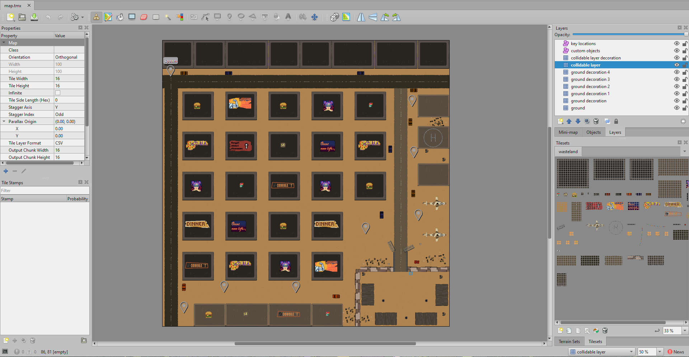

# Extermination Protocol

**Extermination Protocol** is a top-down zombie shooter game where you fight for survival against relentless waves of the undead. As you blast your way through the hordes, you'll earn experience points (XP) to upgrade your arsenal and become a more formidable zombie slayer.

[**See Extermination Protocol in Action**](teaser.mp4)

**Core Gameplay:**
* **Thrilling Top-Down Action:** Navigate the world from a birds-eye view, strategically positioning yourself to take down zombies.
* **Endless Waves of Zombies:** Test your skills against increasingly challenging waves of the undead.
* **Upgrade Your Weaponry:** Earn XP to unlock and upgrade a variety of weapons, helping you survive the onslaught.
* **Experience the Thrill of Survival:** How long can you last? Compete with friends locally or online and perfect your strategies to conquer the endless waves.

**Components:**
* **Zombie:** Your primary adversaries, these relentless creatures seek to consume you.
* **Player:** You, the lone survivor armed with an arsenal of weapons to fight back.
* **Bullet:** Your weapon's projectile, traveling at high speed to dispatch the zombie menace.
* **World:** Explore and navigate the world, utilizing terrain and strategy to your advantage.

**Stay Tuned!**

Extermination Protocol is still under development. This README will be updated with further details as development progresses.
