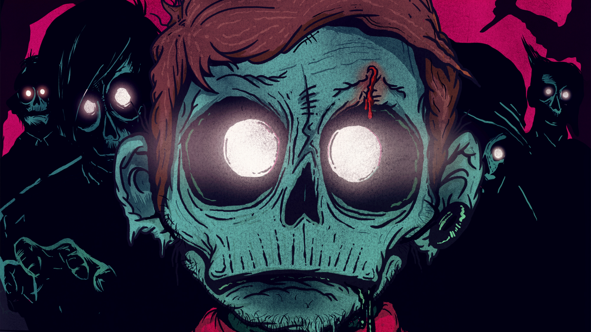
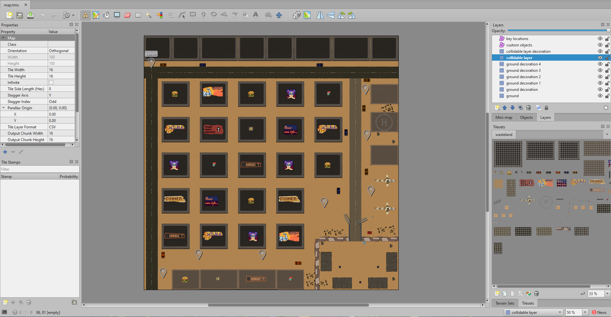

# Extermination Protocol

**Extermination Protocol** is a top-down zombie shooter focused on fast,
wave-based survival. You fight off relentless hordes of undead, earn
experience points, and upgrade your weapons to keep up with the growing
threat.

[**See Extermination Protocol in Action**](teaser.mp4)

## Core Gameplay

-   **Top-Down Combat:** Move and aim from a bird's-eye perspective.
    Positioning and movement are key to staying alive.
-   **Endless Waves:** Zombies spawn in increasingly difficult waves,
    pushing your reflexes and decision-making.
-   **Weapon Upgrades:** Gain XP by eliminating enemies and use it to
    unlock and improve your arsenal.
-   **Survival Challenge:** Last as long as possible and refine your
    strategy to handle higher waves. Compete locally or online.

## Main Components

-   **Zombie:** The primary enemy. They pursue the player relentlessly
    and overwhelm through numbers.
-   **Player:** The survivor controlled by the user, equipped with
    upgradeable weapons.
-   **Bullet:** High-speed projectiles fired by the player to eliminate
    zombies.
-   **World:** The playable environment, designed to support movement,
    positioning, and tactical play.

## Development Status

Extermination Protocol is currently in development. This README will be
updated as new features and improvements are added.
